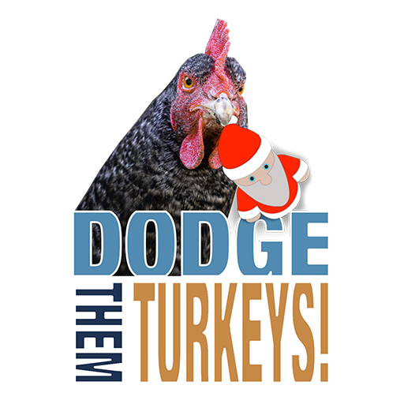

# Dodge them turkeys!!

Can Santa collect all the gifts in time for Christmas or will the turkeys claim the day?!?!!

## Play now!!

* [Play on iPhone / iPad](https://apps.apple.com/us/app/dodge-them-turkeys/id1597616371)
* [Play on Android](https://play.google.com/store/apps/details?id=com.ilfcreative.dodgethemturkeys)
* [Play in a web browser](https://ilf-creative.github.io/dodge-them-turkeys/) - pro tip: you can use arrow keys on a computer

## Development!!

All you need to build this game locally is the [Godot Engine](https://godotengine.org/download). Then simply open the project.godot file in the project folder.

If you just want to poke around in the code take a look at the `.gd` files. They are [GDScript](https://docs.godotengine.org/en/stable/getting_started/scripting/gdscript/gdscript_basics.html) files which is basically weird python.

### Directories

* **docs/** - web build folder (required by GitHub Pages)
* **project/** - godot project root
* **build/** (gitignored) - build target for ios/android

## Credits!!

### Code

This game was created following the [Your First Game](https://docs.godotengine.org/en/stable/getting_started/step_by_step/your_first_game.html) tutorial on the Godot website, and then expanding on that foundation a bit.

All code written by Lenny Urbanowski (or copied from the above tutorial) and released under an [MIT License](LICENSE)

### Art

All art except the snow background created by Lenny Urbanowski. Artwork work is licensed under a [Creative Commons Attribution 3.0 United States License](http://creativecommons.org/licenses/by/3.0/us/)

Snow field background is a photo by [Ant Rozetsky](https://unsplash.com/photos/H9m6mfeeakU) and is licensed under the [unsplash license](https://unsplash.com/license).

### Sound

All sounds are from [freesound.org](https://freesound.org) and licensed under a [Creative Commons 0 License](https://creativecommons.org/share-your-work/public-domain/cc0/)
